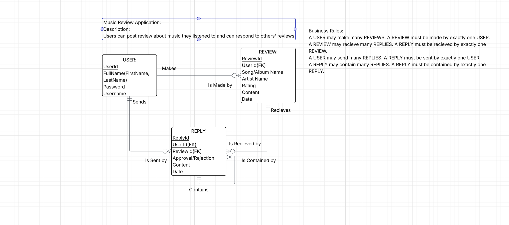

# HearFULLWDPSPRING2026

# My project idea is a music review website called hearFULL. 
The project would basically be a site where users could post reviews about albums/songs that they heard and felt strongly about. 
Key features would most likely be a login feature, post feature with a song/album name, artist name, search, rating(1-10), description fields(<100 words), and finally some kind agree or disagree function(like reddit up or downvotes) or a reply system maybe. 
The purpose of the project would be allowing people to converse about music they recently listened to or even someone trying to find new music to listen to. A casual site for people discuss what they think. Intended users is really all people from young to old and intense music critic to casual listeners. Features are signup, search, login, post, agree/disagree or reply. 

